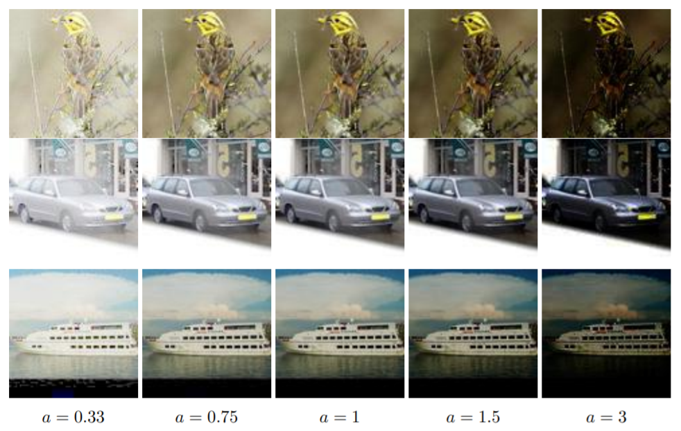
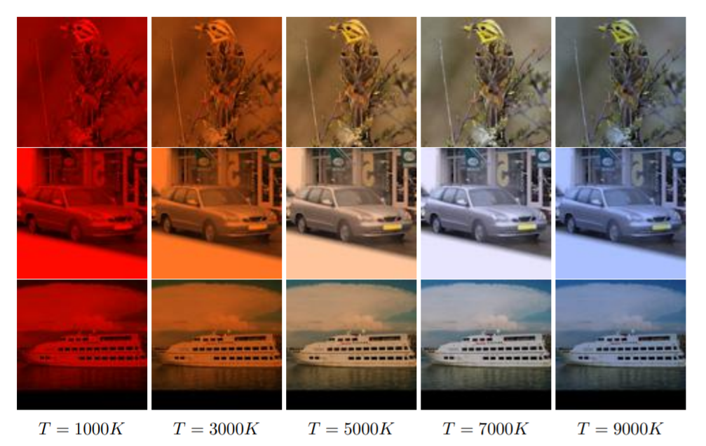
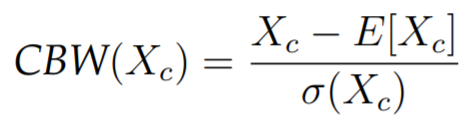

# mgr

This repository contains an implementation of networks and experiments used in my master's thesis on *Equivariant
convolutional neural networks for image recognition*. Text of thesis can be found at https://github.com/kamieen03/magisterka-dokument.

The aim of the work was to develop neural layers invariant or equivariant to changes of lightning. We consider 4 light transformations.
For each of then their defining equation as well as exemplar transformation are shown:
### Contrast

### Brightness

### Gamma correction

### Color balance

# Layers
We develop two invariant layers - __CBW__ and __GBW__. The first one is invariant to contrast, brightness and color balance changes.
The second one in turn to gamma, brightness and color balance changes. They are essentailly modified batch normalization layer:

where Xc is a single channel.

By simple reductions we can prove their invaraince to appropriate operators:

In implementation, it's necessary to add some small constants preventing division by 0 or taking the logarithm of 0, but in practice
these are so small they hardly make any difference in the behavior of layers.

Based on [Bekkers et al.](https://arxiv.org/abs/1909.12057v1), we also develop networks equivariant to lightning transformations
and by a slight modification of the usual batch normalization family of networks equivariant to brightness changes.

# Conclusions
Based on experiments investigating accuracy and generalization levels attained by implemented networks,
we can draw the following conclusions:

* In general networks equivariant
        to lightning-related transformations are for now hard to
        construct. The theoretical framework used in contemporary works doesn't
        fit very well with non-geometric symmetries. Even when it can be adapted
        in some way, it still makes heavy approximations
* The only exception from this rule seem to be very simple
        transformations like brightness and perhaps some of its
        possible generalizations similar to color balance.
        Networks equivariant to these symmetries can be
        after some minor modifications
        realized relatively easily with traditional deep learning components.
* When speaking of lightning symmetries,
        using invariant layers either as the first layer of network or
        if possible after a
        couple equivariant layers seems to be the better choice:
  - They can be relatively easily found for many mathematically
                nontrivial transformations. While precise algorithm involving
                differential equations might be in general hard to construct,
                invariant layers seem to be built easily by alternating
                in some way one of standard forms of normalization.
  - They are preferable from computational point of view
                as they don't require any memory. Computational overhead is also
                bound just to single layer instead of being spread out across
                whole network which eases optimization.
  - For typical computer vision tasks like detection, segmentation
                or classification, it's the invariance that's required, not
                equivariance. In case of detection we don't really care how
                e.g. bright the output image is, as long as the bounding boxes
                are in the right places. And in case of classification or
                segmentation there isn't any output brightness to speak of.
* This stands in sharp contrast with geometric transforms. In their case
        constructing invariant layers placed at the beginning of network would require
        solving yet another computer vision problem. For example in case of
        rotations it would mean detecting relevant objects and estimating their
        rotation with respect to the ground or some other relevant object.
* While the evidence for any of tested invariant layers increasing
        accuracy on test part of datasets is vague at
        best, they without a doubt help generalize to out of distribution
        instances. Even though their numerically measured invariance errors are
        significant, experiments show accuracy is unchanged under various
        transformations. Though the layers are not exactly invariant, they
        perhaps still preserve overall structure of signals which aids
        generalization.
    *In the same way contrast and brightness augmentation don't seem to
        make any difference on base test dataset, but clearly help generalize.
        Augmentation is worth applying even when invariant layers are used.
